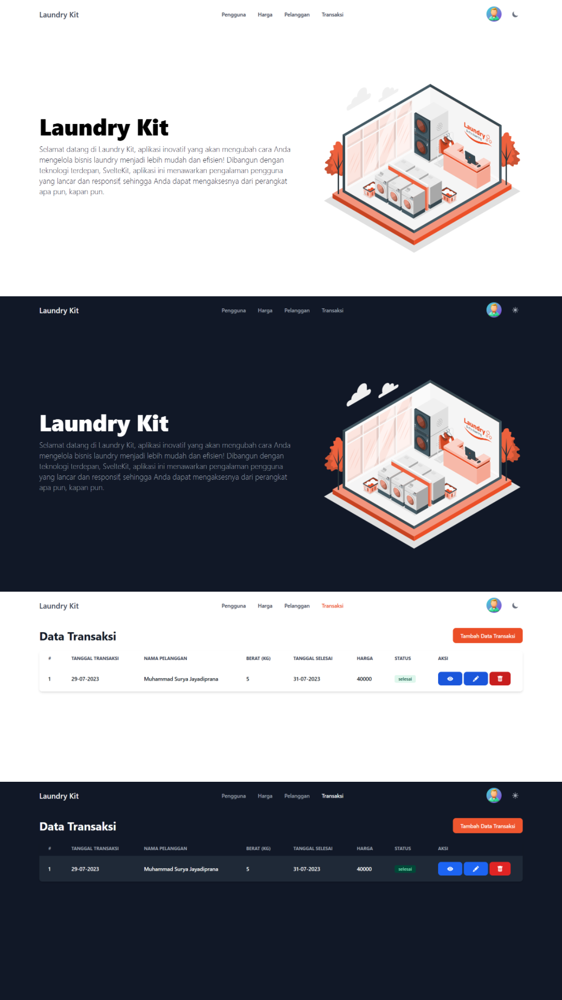
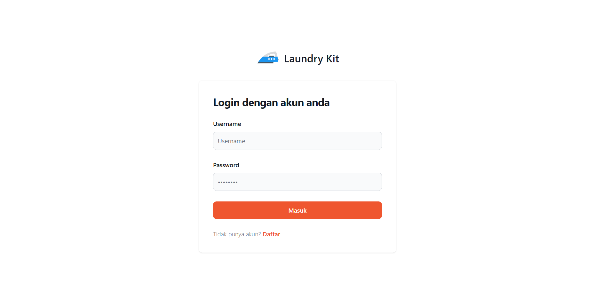
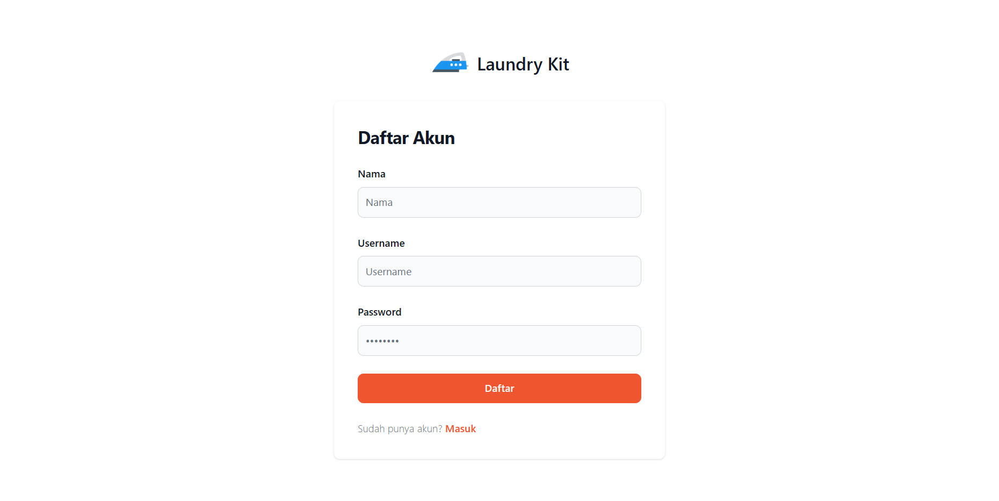

<div align="center" id="top"> 
  
  
  

&#xa0;

  <!-- <a href="https://laundrykit.netlify.app">Demo</a> -->
</div>

<h1 align="center">Laundry Kit</h1>

<p align="center">
  

  

  

  

  

  
</p>

<!-- Status -->

<!-- <h4 align="center">
	🚧  Laundry Kit 🚀 Under construction...  🚧
</h4>

<hr> -->

<p align="center">
  <a href="#dart-about">About</a> &#xa0; | &#xa0; 
  <a href="#rocket-technologies">Technologies</a> &#xa0; | &#xa0;
  <a href="#white_check_mark-requirements">Requirements</a> &#xa0; | &#xa0;
  <a href="#checkered_flag-starting">Starting</a> &#xa0; | &#xa0;
  <a href="#memo-license">License</a> &#xa0; | &#xa0;
  <a href="https://github.com/suryamsj" target="_blank">Author</a>
</p>

<br>

## :dart: About

Laundry Kit merupakan sebuah aplikasi sederhana yang dirancang khusus untuk membantu dalam pengelolaan bisnis laundry. Dengan fitur-fitur yang intuitif dan mudah digunakan, aplikasi ini memberikan solusi yang efisien bagi para pemilik usaha laundry.

## :rocket: Technologies

The following tools were used in this project:

- [Node.js](https://nodejs.org/en/)
- [Sveltekit](https://kit.svelte.dev/)
- [Flowbite](https://flowbite-svelte.com/)
- [Prisma](https://www.prisma.io/)
- [Grid.js](https://gridjs.io/)
- [crypto-js](https://github.com/brix/crypto-js)
- [Storyset](https://storyset.com/)

## :white_check_mark: Requirements

Before starting :checkered_flag:, you need to have [Git](https://git-scm.com) and [Node](https://nodejs.org/en/) installed.

## :checkered_flag: Starting

```bash
# Clone this project
$ git clone https://github.com/suryamsj/laundry-kit

# Access
$ cd laundry-kit

# Install dependencies
$ npm install

# Run the project
$ npm run dev -- --open

# The server will initialize in the <http://localhost:5173>
```

## :memo: Additional

If you want me to make a special change to this application, which you will use personally. You can contact me at :

- [Email](mailto:msurya672@gmail.com)
- [Telegram](https://t.me/ciiciocii)
- [Instagram](https://instagram.com/suryaaamsj)

For now, I'm still making payment features using midtrans. To get the premium version of the Laundry Kit, you can buy it for **Rp. 300,000**.

## :memo: License

This project is under license from MIT. For more details, see the [LICENSE](LICENSE) file.

Made with :heart: by <a href="https://github.com/suryamsj" target="_blank">Muhammad Surya J</a>

&#xa0;

<a href="#top">Back to top</a>
